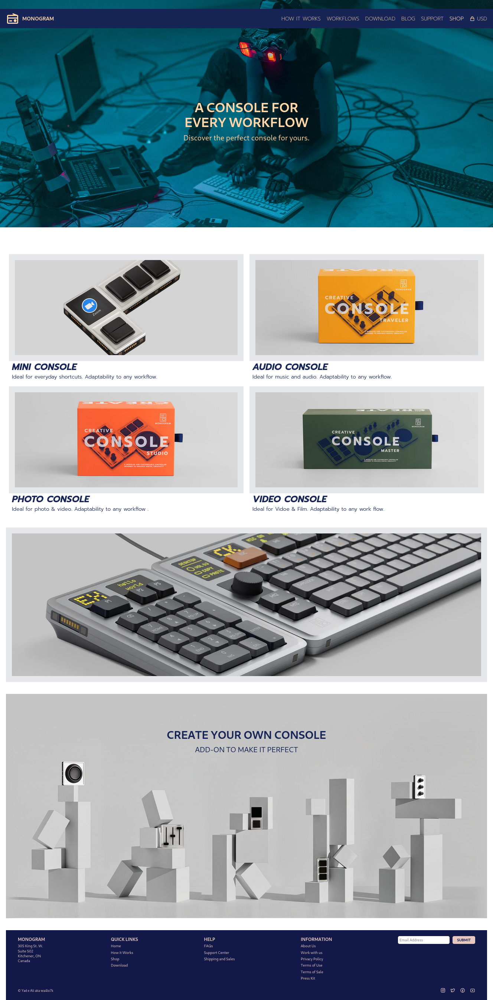

# Monogram - Console for Every Workflow

Monogram is a sleek, **console-themed** website designed for versatility and efficiency. It features a **fully responsive layout**, **dynamic UI elements**, and **Alpine.js-powered interactions** for an enhanced user experience.

## Features

- 🔹 **Fully Responsive** – Optimized for both desktop and mobile.
- 🎨 **Tailwind CSS** – Modern and clean design with utility-first styling.
- ⚡ **Alpine.js Integration** – Lightweight and reactive UI behavior.
- 📱 **Mobile-Friendly Navigation** – Hamburger menu with smooth transitions.
- 🖼 **High-Quality Console Imagery** – Showcasing various console products.
- 📜 **Custom Footer** – Includes quick links, contact details, and social icons.

## Screenshots

### Web Version


### Mobile Version


## Tech Stack

- **HTML5** – Semantic and structured markup.
- **CSS3 & Tailwind CSS** – Rapid styling and responsive design.
- **Alpine.js** – Lightweight JavaScript framework for interactivity.
- **Remix & Boxicons** – Icon libraries for a stylish UI.

## Installation

Clone the repository:
```bash
git clone https://github.com/YOUR_GITHUB_USERNAME/monogram-website.git
cd monogram-website
```

Install dependencies (if using a package manager for Tailwind):
```bash
npm install
```

Start a local server (optional for live preview):
```bash
npx tailwindcss -i ./src/input.css -o ./src/output.css --watch
```

## Usage
Simply open `index.html` in a browser to view the website.

## Contact
For inquiries or support, contact me at [wa4lo7k@proton.me](mailto:wa4lo7k@proton.me).

## License
This project is licensed under the **MIT License**. Feel free to modify and use it for your projects!
